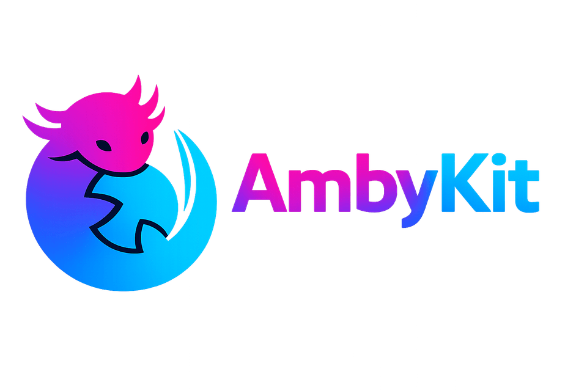

<p align="center">
  
</p>

<p align="center">
  <a href="https://www.npmjs.com/package/@ambystech/ambykit"></a>
  <a href="https://github.com/ambystechcom/AmbyKit/actions/workflows/ci.yml"></a>
  <a href="https://ambystech.io/AmbyKit/"></a>
  
</p>

# AmbyKit

**Spec-Driven Development for AI coding assistants.** Author your specs, user stories, UI design,
plans and tasks **once** — AmbyKit emits native commands and rules for every assistant your team
uses, so the AI builds from clear, testable requirements instead of guessing.

## Quick start

Install from npm and scaffold AmbyKit into your project:

```bash
npm install -g @ambystech/ambykit
ambykit init            # scaffold .amby/ and pick your assistants
# — or run it without installing —
npx @ambystech/ambykit init
```

Already have a project? `init` is **non-destructive** — an existing `CLAUDE.md`/`AGENTS.md` is
preserved (and backed up); AmbyKit only adds/updates its own `### AmbyKit usage` section. Re-run
`ambykit sync` any time to keep it current, or `ambykit restore` to roll a file back.

Then, inside your AI assistant, walk the workflow:

```bash
/amby.constitution   # one-time: set your project's guiding principles
/amby.specify        # describe a feature → spec.md (user stories + EARS requirements)
/amby.clarify        # resolve open questions
/amby.design         # UI spec + design-tokens.json
/amby.plan           # technical plan
/amby.tasks          # ordered, dependency-aware task list
/amby.implement      # build it
```

Track progress from the terminal:

```bash
ambykit dashboard
ambykit dashboard 001:US-3   # story ids restart per feature — qualify with the feature ref
```

📖 Full documentation: **[ambystech.io/AmbyKit](https://ambystech.io/AmbyKit/)**

## Why

AI coding assistants build better software when they start from good requirements. But every
assistant reads a *different* config format, and specs written for one don't carry to another.
AmbyKit fixes both: it gives you a rigorous, tech-agnostic SDD workflow **and** a single source of
truth that compiles to each tool's native format.

- **WHAT before HOW.** `spec.md` captures user stories + testable requirements with no tech
  decisions; `plan.md` captures the technical approach separately.
- **UI is a first-class artifact.** `/amby.design` produces a UI spec + design tokens — the part
  most spec tools skip.
- **Author once, emit per tool.** One neutral source → Claude Code, OpenCode, GitHub Copilot
  (VS Code + CLI), Cursor (+ CLI), Antigravity (IDE + CLI).

## The workflow

| Phase | Command | Output |
|---|---|---|
| Governance (once) | `/amby.constitution` | `.amby/constitution.md` |
| Specify (WHAT/WHY) | `/amby.specify` | `specs/NNN-feature/spec.md` |
| Clarify | `/amby.clarify` | resolves `[NEEDS CLARIFICATION]` markers |
| **Design (UI)** | `/amby.design` | `ui.md` + `design-tokens.json` |
| Plan (HOW) | `/amby.plan` | `plan.md` (+ `data-model.md`, `contracts/`) |
| Tasks | `/amby.tasks` | `tasks.md` |
| Analyze | `/amby.analyze` | cross-artifact consistency report |
| Implement | `/amby.implement` | executes `tasks.md` |

Requirements use **user stories** (`US-#`) + **EARS** functional requirements (`FR-###`) +
**Given/When/Then** acceptance criteria. Stories carry `priority` and `depends-on`/`blocked-by` so
work can be ordered and blocked; `ambykit dashboard` reports progress across the story/task graph.

## Supported tools

Claude Code (CLI + VS Code), GitHub Copilot (VS Code + CLI), OpenCode, Cursor (+ CLI),
Antigravity (IDE + CLI). See [`docs/tool-compatibility.md`](./docs/tool-compatibility.md).

## CLI

| Command | Description |
|---|---|
| `ambykit init [dir]` | Scaffold `.amby/`, pick tools, emit their files + `AGENTS.md`/`CLAUDE.md` |
| `ambykit add <tool…>` | Add/refresh one tool's integration |
| `ambykit sync` | Re-emit all configured tools from the neutral source |
| `ambykit dashboard [story-id]` | Progress view over the story/task graph |
| `ambykit analyze` | Validate the dependency graph (cycles, blockers, orphans) |
| `ambykit check` | Doctor: verify integrations |
| `ambykit restore [file]` | Restore an agent-doc file from its `.amby/backups/` backup |
| `ambykit update` | Update the CLI to the latest, then refresh this project's prompts |

See [`docs/cli-reference.md`](./docs/cli-reference.md).

## Contributing

AmbyKit is built with AmbyKit — see [`AGENTS.md`](./AGENTS.md) and
[`docs/contributing.md`](./docs/contributing.md). MIT licensed.
