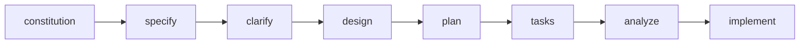
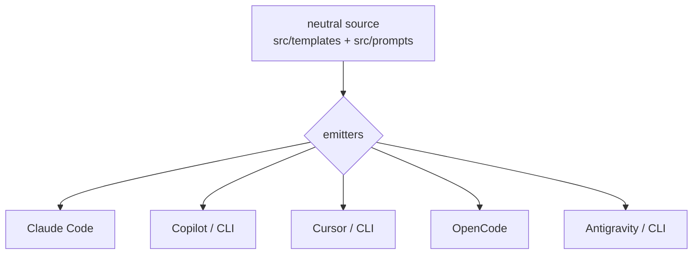
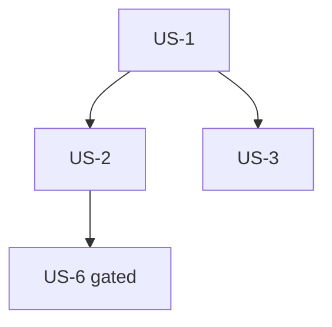

# UI Design — AmbyKit documentation site

> First-class artifact. Once `signed_off: true`, this UI is binding for plan/tasks/implement.
> Tokens live in `design-tokens.json` (same folder); cited by name here, never raw values.
> Conventions: `@.amby/reference/design-conventions.md`.
>
> **Baseline:** the site framework provides the shell (header, collapsible sidebar, site search,
> on-page TOC, responsive layout, light/dark toggle) out of the box. This design specifies the
> **ambystech brand layer**, the **phase-doc structure**, the **diagrams**, and the **home hero** on
> top of that baseline — not a from-scratch layout.

## US-1 — Site shell & navigation

### Layout / wireframe
```
+---------------------------------------------------------------+
| [logo] AmbyKit        ( search… )        [☾/☀] [GitHub »]      |  <- header (component.header)
+------------+----------------------------------+---------------+
| Nav        |  H1  Page title                  | On this page  |  <- sidebar + content + TOC
| » Start    |  body copy …                     |  » Section A   |
| » Workflow |                                  |  » Section B   |
|   · specify|  [ code block ]                  |               |
|   · plan   |                                  |               |
| » CLI ref  |  [ Prev ]            [ Next » ]   |               |
+------------+----------------------------------+---------------+
|  © ambystech · signature-gradient hairline                    |  <- footer
+---------------------------------------------------------------+
```

### Component inventory

#### Header
- **props:** `hasLogo: boolean`
- **states:** default, scrolled (subtle border), logo-missing (placeholder wordmark)
- **tokens:** `component.header.{bg,border,logo-height}`, `component.link.*`
- **behavior:**
  - Given any page, When the header renders, Then it shows the logo (or placeholder), search, a
    theme toggle, and a GitHub link, consistently across pages (US-1).

#### Sidebar nav
- **props:** `sections: {label, items}[]`, `activePath: string`
- **states:** default, item-hover, item-active, collapsed (mobile), expanded-group
- **tokens:** `component.sidebar.{bg,link-fg,link-active-fg,link-active-indicator}`, `semantic.color.focus-ring`
- **behavior:**
  - Given the current page, When the sidebar renders, Then the active item uses `link-active-fg` +
    an indicator; siblings use `link-fg`.
  - Given a keyboard user, When they Tab, Then each item shows a visible focus ring (US-6 a11y).

### Content & accessibility
- Copy: concise, task-oriented headings; every page has exactly one `H1`.
- States: empty search → "No results"; 404 → link back to Start.
- A11y: landmark regions (header/nav/main/footer); skip-to-content link; internal links resolve
  (SC-003); focus ring uses `semantic.color.focus-ring`.

## US-2 — Process documentation (workflow + phase pages)

### Layout / wireframe — phase page template
```
  ┌ PHASE 2 ┐  (phase-badge)
  H1  Specify — turn an idea into a spec

  » Purpose      one-paragraph what/why
  » Command      `/amby.specify` · `ambykit …`        (code-block)
  » Reads        @spec inputs (IDs, not restated)
  » Writes       spec.md  (US-#, FR-###, SC-###)
  » Diagram      [ where-this-sits-in-the-flow ]      (mini sequence, US-3)

  [ « Constitution ]                       [ Clarify » ]   (prev/next)
```

### Component inventory

#### PhaseBadge
- **props:** `n: number`, `name: string`
- **states:** default
- **tokens:** `component.phase-badge.{bg,number-fg,border}`
- **behavior:**
  - Given a phase page, When it renders, Then a numbered badge shows the phase's position in the
    workflow (US-2).

#### PhasePage (content contract)
- **props:** `phase`, `purpose`, `command`, `reads[]`, `writes[]`, `prev?`, `next?`
- **states:** default, first (no prev), last (no next)
- **tokens:** `component.code-block.*`, `component.link.*`, `component.aside.*`
- **behavior:**
  - Given any phase page, When it renders, Then it states purpose, the invoking command, and the
    artifacts it reads/writes, and links prev/next (US-2; FR-003).
  - Given the phase set, When the docs are reviewed, Then all 8 phases have exactly one page
    (SC-002) and a getting-started page chains them for a first run (FR-002).

### Content & accessibility
- Copy: reference artifacts by **stable ID** (US-#, FR-###, T###) rather than restating them
  (Principle 3). Content stays in sync with the source of truth (FR-014).
- A11y: prev/next are real links with descriptive text; code blocks are keyboard-scrollable.

## US-3 — Diagrams (Mermaid)

Three canonical diagrams. All use `component.mermaid.*` tokens so they read on-brand and stay legible
in light **and** dark (FR-005/007). Each diagram is preceded by a one-line text summary (fallback if
rendering fails or JS is off).

### D1 — Workflow sequence (on the Workflow overview page)

- Active/current phase highlighted with `component.mermaid.active-fill` / `active-text`.

### D2 — Author-once, emit-per-tool (on the architecture/concepts page)


### D3 — Story dependency graph (on the workflow/analyze page)


#### Component: Mermaid diagram
- **props:** `source: string`, `caption: string`
- **states:** rendered, fallback (text summary shown), light, dark
- **tokens:** `component.mermaid.{node-fill,node-stroke,node-text,line,cluster-bg,cluster-border,active-fill,active-text}`
- **behavior:**
  - Given a concept page, When it renders in light or dark, Then the diagram nodes/edges/text remain
    legible using the mermaid tokens (US-3).
  - Given diagram JS fails, When the page renders, Then the preceding text summary remains (edge case).

### Content & accessibility
- Each diagram has a text caption/summary conveying the same information (not image-only).
- Diagram text meets AA against `node-fill`; the `active-fill` (sky) pairs with dark `active-text`.

## US-4 — Brand & home hero

### Layout / wireframe — home hero
```
+---------------------------------------------------------------+
|                                                               |
|   [ signature gradient background: #EE1199→#9932CC→#00CCFF ]   |
|                                                               |
|      Spec-Driven Development for AI coding assistants          |  <- title (hero.title-fg)
|      Author once. Emit per tool.                              |  <- subtitle
|                                                               |
|      [ Get started ]   [ View on GitHub » ]                   |  <- button-gradient / link
+---------------------------------------------------------------+
```

### Component inventory

#### Hero
- **props:** `title`, `subtitle`, `ctas[]`
- **states:** default, reduced-motion (no animated gradient), gradient-unsupported (solid fallback)
- **tokens:** `component.hero.{gradient,title-fg,subtitle-fg,fallback-fg}`, `component.button-gradient.*`
- **behavior:**
  - Given the home page, When the hero renders, Then the signature gradient
    (`#EE1199 → #9932CC → #00CCFF`) is the hero surface and CTAs are visible (US-4; FR-006).

#### Brand tokens usage (palette)
- **states:** applied across links, active nav, headings-accent, asides, buttons, footer hairline
- **tokens:** `semantic.color.{brand,accent-blue,accent-orchid,accent-sky}`, `semantic.gradient.brand`
- **behavior:**
  - Given any page, When it renders, Then the ambystech palette and gradient are present and
    consistent in light and dark (US-4).

#### LogoSlot
- **props:** `src?: string`
- **states:** present (image), placeholder (wordmark "AmbyKit" in brand color)
- **tokens:** `component.header.logo-height`, `component.hero.fallback-fg`
- **behavior:**
  - Given no logo asset, When the header renders, Then a placeholder wordmark shows without breaking
    layout; When a PNG (≥512²) is supplied, Then it replaces the placeholder and sets the favicon
    (US-4; FR-011).

### Content & accessibility
- Gradient-clipped/hero text must keep an accessible solid fallback color (`hero.fallback-fg`) and
  real text for screen readers — never text-as-image.
- Bright brand hues are used for **headings / large text / affordances** (AA 3:1), never small body
  copy; body copy uses `semantic.color.text` (AA ≥ 4.5:1 in both modes, incl. on Deep `#040D14`).
- Honor `prefers-reduced-motion`: no gradient animation.

## US-5 — CLI reference & tool-compatibility

### Layout / wireframe
```
  H1  CLI reference
  ## ambykit init        `ambykit init [dir] --tools=…`   (code-block)
      flags · examples

  H1  Tool compatibility
  | Tool         | Rules file | Command surface | MCP key |   <- table (scrolls if narrow)
  | Claude Code  | CLAUDE.md  | commands        | .mcp.json |
```

### Component inventory

#### ReferenceEntry
- **props:** `command`, `usage`, `flags[]`, `examples[]`
- **states:** default
- **tokens:** `component.code-block.*`, `component.link.*`
- **behavior:**
  - Given a command name, When a user searches, Then its reference entry is found (US-5; SC-007).

#### CompatibilityTable
- **props:** `rows: {tool, rulesFile, surface, mcpKey}[]`
- **states:** default, overflow (horizontal scroll within container)
- **tokens:** `component.table.{header-bg,border,stripe}`
- **behavior:**
  - Given the compatibility page, When it renders, Then every supported assistant and its command
    surface is listed (US-5).
  - Given a narrow viewport, When the table is wider than the screen, Then it scrolls within its own
    container, not the page (edge case; US-6).

### Content & accessibility
- Tables use real `<th>` headers with scope; wide tables scroll in an `overflow-x` wrapper.

## US-6 — Responsive, accessible & published (capability states)

US-6 is largely cross-cutting behavior over the components above, driven by viewport + environment:

| Condition | Effect |
|---|---|
| Viewport < ~768px | Sidebar collapses to a toggle; content is single-column; no horizontal overflow (FR-009). |
| Viewport ≥ 320px … desktop | Fluid reflow; images/tables/code contained (SC-006). |
| Light / dark | All semantic `{light,dark}` tokens swap; diagrams re-theme (FR-007). |
| `prefers-reduced-motion` | Gradient/hover animations disabled. |
| No JS | Content + text diagram summaries remain readable; search may degrade. |
| Merge to default branch | GitHub Actions builds and publishes to GitHub Pages (FR-015). |

- A11y (WCAG AA): AA contrast for text (≥4.5:1) and affordances (≥3:1) in **both** modes, including
  brand colors on Deep `#040D14`; keyboard-navigable nav/search/toggle with visible focus; skip
  link; landmark roles. Honors constitution **Principle 6** (docs stay in sync, CI-gated) and
  **Principle 1** (single source of truth for workflow content).

## Sign-off

- [x] Reviewed and approved. — Gustavo Barrientos, 2026-07-07
